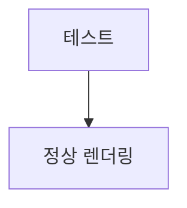
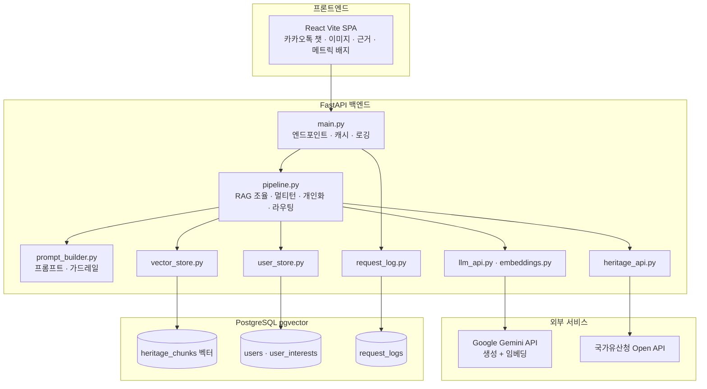
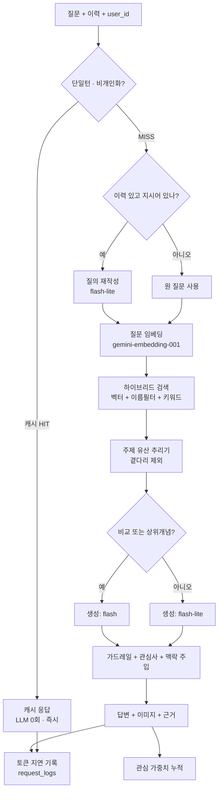
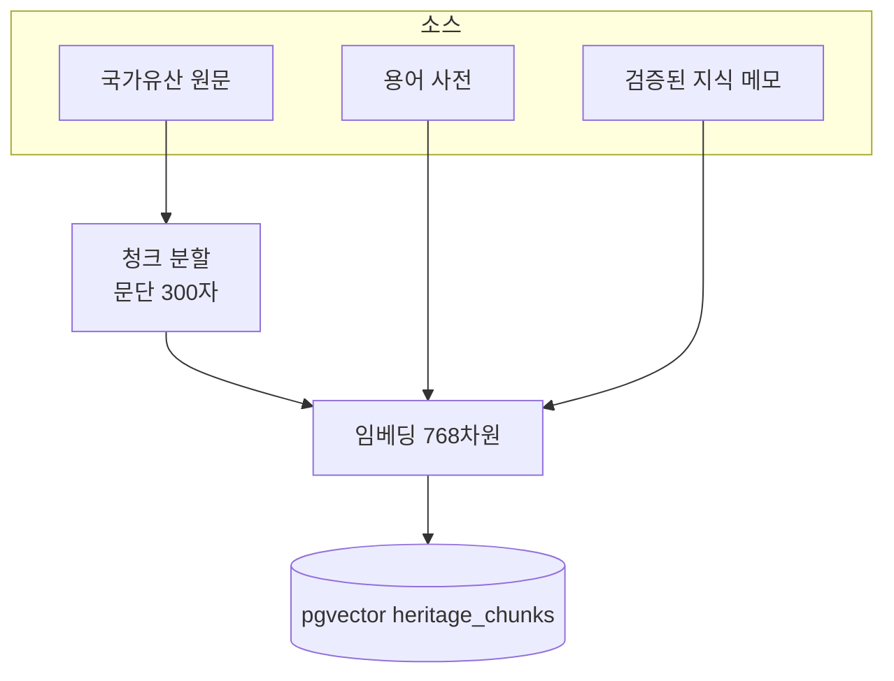
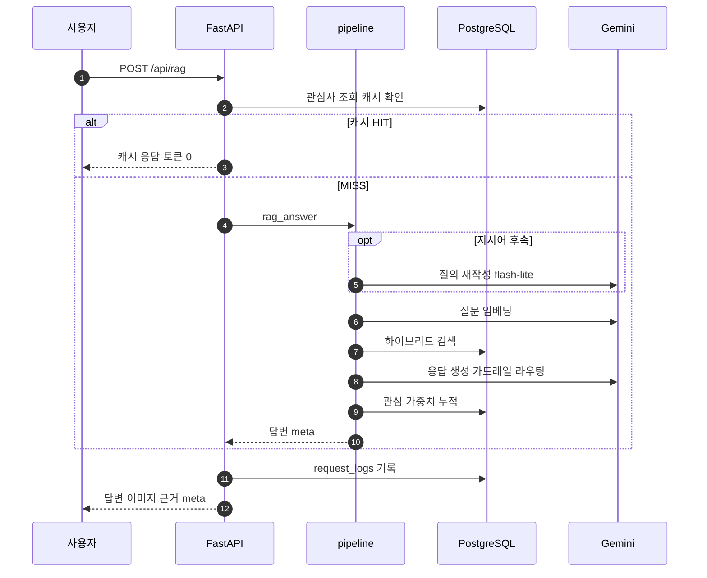

# 시스템 아키텍처 · 다이어그램

> 모든 그림은 **Mermaid**. VS Code의 *Markdown Preview Mermaid Support*(`bierner.markdown-mermaid`) 확장 또는 GitHub에서 렌더링된다.

## 0. 렌더링 테스트
아래 가장 단순한 그림이 **안 보이면 확장/프리뷰 문제**(확장 설치·창 새로고침·VS Code 내장 미리보기 사용), **보이면 정상**이다.



- [1. 시스템 아키텍처](#1-시스템-아키텍처)
- [2. ERD](#2-erd-데이터-모델)
- [3. RAG 질의 플로우](#3-rag-질의-플로우-apirag)
- [4. 기본 해설 파이프라인](#4-기본-해설-파이프라인-apiheritage)
- [5. 데이터 적재 파이프라인](#5-데이터-적재-파이프라인)
- [6. 요청 시퀀스](#6-요청-시퀀스)

---

## 1. 시스템 아키텍처



> pgvector는 별도 DB가 아니라 **PostgreSQL의 확장**. 벡터·개인화·로그 테이블이 한 DB에 있다.

---

## 2. ERD (데이터 모델)

```mermaid
erDiagram
  USERS ||--o{ USER_INTERESTS : owns
  USERS ||..o{ REQUEST_LOGS : refs

  HERITAGE_CHUNKS {
    int id PK
    text source_type
    text heritage_name
    text term
    int chunk_index
    text content
    text image_url
    text category
    vector embedding
  }

  USERS {
    text id PK
    timestamp created_at
  }

  USER_INTERESTS {
    text user_id FK
    text category
    real weight
  }

  REQUEST_LOGS {
    int id PK
    timestamp ts
    text endpoint
    text question
    text user_id
    bool cached
    bool condensed
    bool multiturn
    text answer_model
    int total_tokens
    int latency_ms
    int num_sources
  }
```



> `source_type` 은 heritage / term / note. `category` 는 분류(bcodeName)로 개인화 가중치에 쓰인다.

---

## 3. RAG 질의 플로우 (`/api/rag`)



---

## 4. 기본 해설 파이프라인 (`/api/heritage`)


---

## 5. 데이터 적재 파이프라인



> 명령: `python ingest.py` · `--bulk 11 25` · `--notes` · `--backfill-categories`

---

## 6. 요청 시퀀스



---

### 관련 문서
[RAG 원리](RAG.md) · [정확도 평가](EVAL.md) · [README](../README.md)
```
